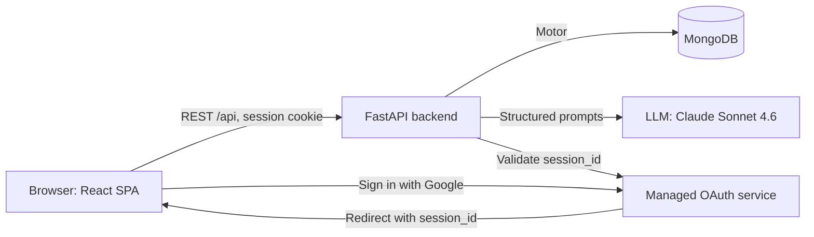

# ReplyRush

**AI-powered review and complaint reply assistant for small local businesses.**
Never leave a review unanswered again.

ReplyRush reads what a customer actually wrote, drafts a specific and honest reply in seconds, and shows the owner which problems keep repeating across platforms.

---

## Problem

Small business owners receive reviews and complaints on Google, Zomato, Amazon, Yelp and Instagram, but rarely have time to answer each one personally.

- Unanswered negative reviews damage trust with future customers.
- Copy-pasted templates ("we're sorry for the inconvenience") make things worse because customers can tell nobody read their review.
- Feedback is scattered across platforms, so recurring problems (slow delivery, rude staff) go unnoticed until they hurt revenue.
- Generic AI writing tools tend to invent refunds, discounts and promises the owner never approved, which creates real liability.

## Solution

ReplyRush gives owners one place to handle feedback from every platform.

1. **Connect** a platform and see its reviews, with the most urgent ones first.
2. **Generate** a reply written from the actual review text, in the tone and business context the owner chooses.
3. **Edit and copy** the draft, then paste it wherever the review lives.
4. **Watch Issue Radar** to spot complaint themes that keep repeating and get one suggested action for each.

The reply engine follows a strict honesty rule. It never invents refunds, compensation, policies, staff actions, discounts, resolutions, contact details or promises. The only resolutions it may mention are those the owner types into the "What can you actually offer?" field. If the owner offers nothing, the reply acknowledges the specific issue and invites the customer to get in touch, without making anything up.

ReplyRush **drafts replies only**. It never posts to any platform.

## Features

**Reply generation**
- One real LLM call per reply, returning the reply text, sentiment, urgency flag, urgency reason and 1-3 themes as structured JSON.
- Replies reference specifics from the review (the dish, the delay, the product defect, the staff behaviour) and vary in structure and wording every time.
- Replies come back in the same language as the review, and the seed data includes Spanish and French examples.
- Business type (Restaurant, Retail Store, Salon, Service Business, Other) shapes vocabulary.
- Tone selector: Friendly, Formal, or Apologetic-and-solution-focused.
- Editable draft, one-click Copy Reply, and Regenerate for a different version.
- Length target of roughly 50-120 words, suited to public platforms.

**Urgency flags**
- Red: angry, urgent, or threatening to leave, report or escalate.
- Yellow: moderately negative.
- Green: neutral or positive.
- Lists always sort red first, then yellow, then green.

**Issue Radar**
- Every review carries 1-3 themes from a fixed set: Product quality, Delivery/Wait time, Staff/Service, Pricing/Value, Cleanliness/Environment, Order accuracy, Refund/Billing, Other.
- Dashboard bars show each theme's count for the last 30 days, split by platform logo, with a trend arrow against the previous 30 days.
- A pulsing "Needs attention" banner appears when a theme has 3 or more negative reviews or 2 or more red flags.
- Clicking a theme opens a drawer with the matching reviews and one "Suggested action", grounded only in those reviews and cached until new reviews arrive.

**Dashboard and workflow**
- Analytics: total reviews handled, positive vs negative split (donut chart), estimated time saved (5 minutes per reply), and animated counters.
- Platform cards for Google, Zomato, Amazon, Yelp and Instagram, each with its real brand icon.
- Simulated Connect flow with a loading animation, then platform-styled review cards.
- Add Review Manually, so owners can paste a review from anywhere.
- History page listing every handled review with platform logo, flag colour, reply and date, filterable by platform and flag.
- Google sign-in with account chooser, per-user data, and a responsive interface with animated landing and login pages.

## Architecture



**Flow overview**

1. **Sign-in.** The frontend redirects to a managed Google OAuth service with `prompt=select_account`. The user returns with a `session_id`, which the backend validates. The backend then creates a 7-day session and sets an httpOnly cookie.
2. **Connect.** `POST /api/connect/{platform}` copies that platform's pre-tagged seed reviews into the user's account (once only) and returns them sorted by urgency. No LLM call happens here.
3. **Generate.** `POST /api/reviews/{id}/generate` sends the review, business type, tone and owner-provided offer to the LLM. It returns JSON, which is parsed and stored. Seeded reviews keep their pre-set flag and themes. Manually added reviews are tagged by this same call.
4. **Radar.** `GET /api/issue-radar` aggregates themes over rolling 30-day windows. `GET /api/issue-radar/theme` returns matching reviews plus a cached suggested action.

**API routes** (all under `/api`)

| Route | Purpose |
|---|---|
| `POST /auth/session`, `GET /auth/me`, `POST /auth/logout` | Session handling |
| `GET /platforms/status` | Connection state and review count per platform |
| `POST /connect/{platform}` | Simulated connect, returns seeded reviews |
| `GET /reviews`, `GET /reviews/{id}` | List (filter by platform, flag, handled) and fetch |
| `POST /reviews/manual` | Add a pasted review |
| `POST /reviews/{id}/generate` | Generate and store a reply |
| `GET /analytics` | Dashboard totals |
| `GET /issue-radar`, `GET /issue-radar/theme` | Theme aggregation and drill-down |

**Data model (MongoDB collections):** `users`, `user_sessions`, `reviews` (platform, rating, text, flag, sentiment, themes, language, reply, handled, source), and `theme_actions` (cached suggested actions). Every query is scoped by `user_id`, so users never see each other's data.

**Project structure**

```
backend/
  server.py        FastAPI app, auth, reviews, LLM calls, analytics, radar
  seed_data.py     25 pre-tagged sample reviews
  tests/           Backend API tests (pytest)
frontend/
  src/pages/       Landing, Login, Dashboard, ConnectView, ReplyStudio, History
  src/components/  IssueRadar, ThemeDrawer, AnalyticsWidget, ReviewCard, PlatformCard, ...
  src/lib/         API client and platform brand config
```

## Tech Stack

| Layer | Technology |
|---|---|
| Frontend | React 19, React Router, Tailwind CSS, shadcn/ui, framer-motion, Recharts, Sonner (toasts) |
| Icons | react-icons (Simple Icons set and Font Awesome for platform brands, FcGoogle for sign-in) |
| Backend | Python, FastAPI, Uvicorn, Pydantic |
| Database | MongoDB via Motor (async driver) |
| Auth | Google OAuth through a managed OAuth service, httpOnly session cookies |
| AI | Anthropic Claude Sonnet 4.6, accessed through a managed LLM integration library (see `backend/requirements.txt`) |
| Testing | pytest (backend API tests) |

## How to Run

### Prerequisites

- Python 3.11 or newer
- Node.js 18 or newer and Yarn
- A running MongoDB instance
- An LLM API key for the managed LLM integration
- Access to the managed Google OAuth service the login flow is built on

### 1. Backend

```bash
cd backend
python -m venv .venv
source .venv/bin/activate        # Windows: .venv\Scripts\activate
pip install -r requirements.txt
```

Create `backend/.env`:

```env
MONGO_URL=mongodb://localhost:27017
DB_NAME=replyrush
LLM_API_KEY=your_llm_key_here
CORS_ORIGINS=http://localhost:3000
```

Start the server:

```bash
uvicorn server:app --host 0.0.0.0 --port 8001 --reload
```

The API is now at `http://localhost:8001/api`.

### 2. Frontend

```bash
cd frontend
yarn install
```

Create `frontend/.env`:

```env
REACT_APP_BACKEND_URL=http://localhost:8001
```

Start the app:

```bash
yarn start
```

Open `http://localhost:3000`.

### 3. Try the demo flow

1. Click **Get Started** and sign in with Google.
2. On the dashboard, click **Connect** on Zomato and Google. The Issue Radar banner lights up because the sample data contains repeated delivery and staff complaints.
3. Open a theme to see its reviews and suggested action.
4. Open a red-flagged review, choose a business type and tone, leave "What can you actually offer?" empty, and click **Generate Reply**. Check that the reply invents no refund or contact details.
5. Type an offer, click **Regenerate**, and confirm the reply uses only what you wrote.
6. Open the Spanish and French reviews to see language matching.
7. Open **History** to review every reply.

### Run the tests

```bash
cd backend
pytest
```

The tests call a running backend, so start the server first.

## Limitations

- **Platform connections are simulated.** Connect loads 25 pre-seeded sample reviews (5 per platform). ReplyRush does not call the Google Business Profile, Zomato, Amazon, Yelp or Instagram APIs, which require business verification and app review.
- **No auto-posting.** Replies are drafts. The owner copies them and posts manually.
- **Seed dates are relative.** Sample reviews are dated relative to the moment of first Connect so the 30-day Issue Radar always has data. Real imported data would use real timestamps.
- **Manual reviews are tagged by the LLM.** Themes and flags for pasted reviews depend on model judgment and can occasionally be off. The owner can still edit the reply, but cannot yet correct the flag or themes.
- **Language field is not detected for manual reviews.** The stored language defaults to English, although the reply itself follows the review's language.
- **Time saved is an estimate.** It assumes a flat 5 minutes per reply, not measured usage.
- **Depends on managed services.** Sign-in and LLM access use hosted integrations. Running the app outside its original hosting environment requires those services or replacing them with your own OAuth setup and LLM client.
- **Limited testing.** Backend routes have API tests. The frontend has no automated tests, and there is no rate limiting on LLM endpoints.
- **English-first interface.** The UI is in English, and only replies adapt to the review's language.

## Future Scope

- **Real platform integrations** for Google Business Profile, Yelp and others, with an approval flow before any reply is posted.
- **Owner-editable flags and themes**, with corrections fed back to improve tagging.
- **Reply presets**, so a business saves its preferred tone, business type and standard offers.
- **Sentiment trends over time**, showing whether complaints are rising or falling week by week.
- **Weekly Issue Radar email digest** with the top complaint themes.
- **Reply quality checks** that flag drafts which are too long, too generic, or that mention anything not authorised by the owner.
- **Multi-location and team access** with roles, for businesses with several branches or staff.
- **Localised interface** so owners can use the app in their own language.
- **Automatic language detection** for manually added reviews.
- **Frontend test suite and rate limiting** for production readiness.

## License

Add your preferred license here (for example, MIT).
